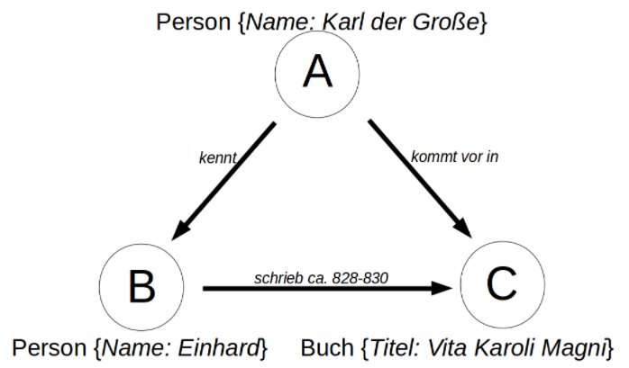
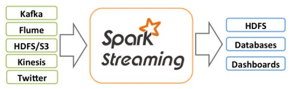
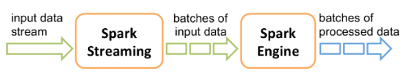

#### [Zum Anfang](README.md "Hier gelangen Sie zur Startseite") | [Inhaltsverzeichnis](00_Inhaltsverzeichnis.md "Hier gelangen Sie zum Inhaltsverzeichnis")

# 1 Spark
Ziel dieser arbeit ist es, dem Leser dieser Arbeit einen kurzen und grundlegenden Einblick in
[Apache Spark](https://spark.apache.org/ "zur Einstiegsseite") 
zu geben. 

Am Ende soll der Leser einen Eindruck davon haben, was
[Apache Spark](https://spark.apache.org/ "zur Einstiegsseite") 
ist, wie es eingesetzt werden kann und wo seine Anfänge liegen. Wichtige Begriffe im Umfeld von 
Spark können zugeordnet werden und ermöglichen, sich selbstständig weiter in die Materie einzuarbeiten.

Auf Basis der Sprache Python und eines Jupyter Notebooks werden in Abschnitt 
[vier](04_Wordcount_mit_Spark_RDDs_und_Python.md "Beispiel einer realen Anwendung mit Spark RDDs und Python")
und 
[fünf](05_Wordcount_mit_Spark_DataFrames_und_Python.md "Beispiel einer realen Anwendung mit Spark DataFrames und 
Python")
zwei einfache Beispiele vorgestellt, wie
[Apache Spark](https://spark.apache.org/ "zur Einstiegsseite")
zur Lösung eines Problems genutzt werden kann. 
Dieser Code ist frei verfügbar und kann als Startpunkt für eigene Programme dienen.

* [Was ist Spark](01_Spark.md#sprachunterstützung)
* [Bisherige Entwicklungsgeschichte](01_Spark.md#bisherige-entwicklungsgeschichte)
* [Sprachunterstützung](01_Spark.md#sprachunterstützung)
* [Spark Ökosystem und Erweiterungen](01_Spark.md#spark-ökosystem-und-erweiterungen)

## Was ist Spark

[_zurück_](01_Spark.md#1-Spark "Zurück")

Bei 
[Apache Spark](https://spark.apache.org/ "zur Einstiegsseite")
handelt es sich um ein Framework, welches Daten aus einer Vielzahl an Quellen einlesen, 
verarbeiten und ausgeben kann. Es ist somit in erster Linie für die Verarbeitung, nicht aber für deren 
Haltung zuständig.

Es verdankt seine Bedeutung der Tatsache, das es imstand ist, auch sehr große Datenbestände im Petabereich 
in kurzer Zeit verarbeiten zu können. Hierbei verteilt
[Apache Spark](https://spark.apache.org/ "zur Einstiegsseite") 
die Verarbeitung und führt zu einem späteren Zeitpunkt die Ergebnisse wieder zusammen.

Daneben können nicht nur strukturierte Daten, sondern auch unstrukturierte oder als Stream vorliegende
Daten verarbeitet werden. Hierfür existieren mehrere Zusätze, auf die später eingegangen wird.

Den Kern des Frameworks bilden grundlegende Funktionen wie die Ablaufsteuerung, die Aufgaben- und
Zeitplanung sowie die Bereitstellung von Input- und Output-Operationen. Die zugrunde liegende Datenstruktur
basiert auf Resilient Distributed Datasets (RDD), welche im Abschnitt 
[Datenstrukturen](02_Datenstrukturen.md "zum Abschnitt 02 Datenstrukturen") 
ausführlich eingegangen wird. Sie ermöglichen die Performante, hoch skalierbare und verteilte Bearbeitung 
sehr großer Datenmengen.

Auch wenn Spark selbst in Scala geschrieben wurde, unterstützt es neben Java die im Bereich Big Data 
wichtigen Sprachen Python und R.

## Bisherige Entwicklungsgeschichte

[_zurück_](01_Spark.md#1-Spark "Zurück")

Nach 
[eigenen Angaben](https://spark.apache.org/history.html "zur Webseite")
startete Apache Spark 2009 als ein Forschungsprojekt an der 
[UC Berkley](https://www.berkeley.edu/ "zur Webseite")
in Californien und wurde 2010 als Open Source Projekt veröffentlicht. In den folgenden Jahren erschienen 
eine Reihe wissenschaftlicher Puplikationen, die sich mit den zugrunde liegenden Ideen beschäftigten. Es bildete sich 
eine rasch wachsende Community. Seit 2014 ist es als 
[Top-Level-Projekt](https://blogs.apache.org/foundation/entry/the_apache_software_foundation_announces50 "Zum 
Blogeintrag")
Teil der
[Apache Software Foundation](https://www.apache.org/ "zur Webseite").
Als Nutzer werden u.a. IBM, Intel und Yahoo aufgelistet.

Laut angaben von
[Databricks](https://databricks.com/de/spark/about "Zur Webseite") 
arbeiten (Stand 2021) über 1000 aktive Entwickler aus mehr als 250 Unternehmen und Organisationen an dem Projekt mit, 
welches sich zur größten Open Source Community im Bereich Big Data entwickelt habe. Am 13. Oktober 2021 wurde die 
aktuelle 
[Version 3.2.0](https://spark.apache.org/releases/spark-release-3-2-0.html "zur Webseite") 
veröffentlicht. 

Ebenfalls in 2013 wurde von den ehemaligen Entwicklern die Firma  
[Databricks](https://databricks.com "Zur Einstiegsseite von Databricks")
ins Leben gerufen. Databricks sieht sich selbst in der Verantwortung, das offene Entwicklungsmodell von Spark 
aufrecht zu erhalten und Spark selbst weiter zu entwickeln. Gleichzeitig verdient es Geld im Umfeld von Spark unter 
anderen durch Online Kurse und Eigenentwicklungen auf Basis von Spark wie **_lakehouse_**, einer eigenen Cloud Data 
Plattform. 

Laut 
[Wikipedia](https://en.wikipedia.org/wiki/Databricks "Zum Wikipediaeintrag von Databricks") 
arbeitet Databricks seit 2017 mit Microsoft zusammen, und ist hier unter den Namen **_Azure Databricks_** verfügbar. 
2021 Wurde eine Kooperation mit Google eingegangen, um Spark in dessen Cloud verfügbar zu machen. 

## Sprachunterstützung

[_zurück_](01_Spark.md#1-Spark "Zurück")

Auch wenn Apache Spark ursprünglich in Scala programmiert wurde, unterstützt es eine Reihe weiterer Sprachen, 
darunter die für das Umfeld von Big Data und Machine Learning wichtigen Sprachen Python und R.

Auf der 
[Übersichtsseite](https://spark.apache.org/docs/latest "zur Übersichtsseite")
zur aktuellen Version 3.2.0 (Stand Dezember 2021) werden die unterstützten Sprachen und 
deren jeweilige Mindestversion näher angegeben. Hiernach wird 

- [Java](https://openjdk.java.net/ "zur Webseite von OpenJDK")
  8/11 (Versionen vor 8u201 sind deprecated ab Spark 3.2.0, Maven Support, kann DataSets nutzen)
- [Scala](https://www.scala-lang.org/ "zur Webseite")
  2.12 (Maven Support, kann DataSets nutzen)
- [Python](https://www.python.org/ "zur Webseite")
  3.6+ (Version 3.6 und davor sind deprecated ab Spark 3.2.0, PySpark)  
- [R](https://www.r-project.org/ "zur Webseite")
  3.5+ (SparkR)
 

unterstützt. Insbesondere bei der Zusammenarbeit mit 
[Apache Arrow](https://arrow.apache.org/ "zur Webseite") 
wird zudem auf mögliche Probleme Im Umfeld von Java und Python angesprochen und auf die entsprechende 
[Dokumentation](https://arrow.apache.org/docs/ "zur Dokumentation") 
verwiesen.

Mit Spark SQL besteht zudem die Möglichkeit, auf strukturierte Daten unter Verwendung von 
[SQL](https://de.wikipedia.org/wiki/SQL "zur Wikipediaseite") 
(Structured Query Language) zuzugreifen.

Die Verwendung von Java und Scala als höhere objektorientierte Programmiersprachen ermöglicht die Verwendung der mit 
SparkSQL zuletzt eingeführten streng typisierten Datasets im Code zu nutzen. Ein weitere Vorteil dieser Sprachen ist 
die Möglichkeit, Apache Spark mit Hilfe von Maven direkt in Projekte einzubinden. 

### PySpark

Für die Arbeit Python existiert mit 
[PySpark](https://spark.apache.org/docs/latest/api/python/index.html "zur Webseite")
ein Interface, dass eine starke Integration vmit Python ermöglicht. 
Daneben existieren eine Vielzahl an Erweiterungen im Python, so dass keinerlei Einschränkungen bei der Arbeit 
mit Python existieren. Die fehlende Möglichkeit, SparkSQL zu nutzen, wird durch das Vorhandensein entsprechender 
Alternativen ausgeglichen. 

### SparkR

Mit
[SparkR (R on Spark)](https://spark.apache.org/docs/latest/sparkr.html "zur Webseite")
existiert leichtgewichtiges Frontend zur Nutzung von Spark. Daneben unterstützt das Paket auch das verteilte Lernen 
in Zusammenarbeit mit SparkML. Nach Meinung des Authors, scheint die Integration von Python jedoch bei weitem 
tiefergehend und in sich intuitiver zu sein. 

## Spark Ökosystem und Erweiterungen

[_zurück_](01_Spark.md#1-Spark "Zurück")

In und um Spark hat sich ein sehr umfangreiches Ökosystem entwickelt, welches Spark als Framework erweitert oder
aber auf die Fähigkeiten von Spark basieren, diese nutzen ober aber nutzen können. Hierbei handelt es sich nicht
nur um Software im Umfeld der 
[Apache Foundation](https://www.apache.org "zur Webseite") 
oder aber Open Source, sondern im starken MAße auch um kommerzielle 
Software. Auf der 
[Homepage von Spark](https://spark.apache.org "zur Webseite") 
findet sich hierzu eine Übersicht. Bekannte Vertreter hieraus sind:

* [mongoDB (Open Source)](https://www.mongodb.com "zur Webseite")
* [SQL Server (Microsoft)](https://www.microsoft.com/de-de/sql-server/sql-server-2022 "zur Webseite")
* [tableau (Salesforce.com)](https://www.tableau.com/de-de "zur Webseite")
* [Power BI (Microsoft)](https://powerbi.microsoft.com/de-de "zur Webseite")
* [PyTorch (facebook)](https://pytorch.org "zur Webseite")
* [TensorFlow (Google)](https://www.tensorflow.org "zur Webseite")

Im Folgenden soll kurz auf die wichtigsten Erweiterungen im direkten Umfeld von Spark eingegangen werden, welche das 
Framework erweitert und breiter aufgestellt haben. Eine erschöpfende Betrachtung würde hierbei den Rahmen und die 
Zielsetzung dieser Arbeit bei weitem sprengen. Hier sei auf die jeweils angegebenen Projektseiten verwiesen:

* [SparkSQL (Unterstützung für strukturierte Daten)](https://spark.apache.org/sql "zur Einstiegsseite")
* [MLlib (Unterstützung für maschinelles Lernen)](https://spark.apache.org/mllib "zur 
  Einstiegsseite")
* [GraphX (Unterstützung für Graphenbasierte Strukturen)](https://spark.apache.org/graphx "zur Einstiegsseite")
* [Spark Streaming (Unterstützung für Streaming)](https://spark.apache.org/streaming "zur Einstiegsseite")

### SparkSQL

[SparkSQL](https://spark.apache.org/sql "zur Einstiegsseite") 
erweitert und vereinfacht den Umgang mit strukturiert vorliegenden Daten und stellt eine der wichtigsten 
Erweiterungen von Spark da. Ein wichtiger Kern stellt die Einführung von DataFrames und darauf folgend von DataSets 
dar. Diese können direkt oder aber aus zugrunde liegenden RDDs erstellt werden. 

In der nachfolgenden Version wurden beide Konstrukte zusammengeführt. Ein DataFrame wird hier als ein DataSet vom 
Typ Row angesehen und kann auch unstrukturierte Daten enthalten. Ein weiteres wichtiges Features ist die Möglichkeit, 
SQL zur Abfrage und Selektion strukturiert vorliegender Daten verwenden zu können.

Im Abschnitt 
[02 Datenstrukturen, Spark](02_Datenstrukturen.md#Spark "zum Abschnitt")
wird hierauf näher eingegangen. Daneben existiert auf Seite von Spark eine umfassende 
[Dokumentation von SparkSQL](https://spark.apache.org/docs/latest/sql-programming-guide.html "zur Dokumentation"). 

### MLlib

Die 
[Maschine Learning Library (MLlib)](https://spark.apache.org/mllib "zur Einstiegsseite")
von Apache Spark bietet Zugang zu einer umfangreichen Bibliothek für die Bearbeitung und dem Cleaning von Daten. 
Hierzu gehören neben Funktionen zum Aggregieren von Daten auch Algorithmen für die Klassifizierung, der Regression 
oder dem Clustering. 

Gegenüber anderen Bibliotheken aus diesem Bereich, wie beispielsweise 
[scikit-learn](https://scikit-learn.org "zur Einstiegsseite")
, können mit ihr auf Basis von Spark auch sehr große Datenkontingente sehr performant, verteilt und skalierbar 
verarbeitet werden. Daneben existieren Hilfsfunktionen zur Unterstützung von Routineaufgaben wie der Erzeugung 
von Statistiken.

Weiterhin werden die Erstellung von Workflows für die Verarbeitung (Pipelines) und das Erstellen und Trainieren von 
Modellen sowie deren Serialisierung und Einsatz unterstützt.

Im Zentrum dieser Arbeit liegt Spark selbst. Daher wird in dieser Arbeit nicht tiefer auf diese Erweiterung 
eingegangen. Hier sei auf die sehr umfangreiche 
[Dokumentation](https://spark.apache.org/docs/latest/ml-guide.html "zur Dokumentation") 
verwiesen.

### GraphX

Bei 
[GraphX](https://spark.apache.org/graphx "zur Einstiegsseite") 
handelt es sich um eine Erweiterung, welche die Möglichkeit eröffnet, im Kontext von Spark mit Graphen zu 
arbeiten. Nach 
[eigenen Angaben](https://spark.apache.org/docs/latest/graphx-programming-guide.html "zur Dokumentation") 
erweitert es die grundlegende und auf Basis der 
[RDD]([02 Datenstrukturen, Spark](02_Datenstrukturen.md#Spark "zum Abschnitt")) 
aufgebaute Struktur um eine Graphenabstraktion. Hierzu wurden mehrere notwendige Erweiterungen für die Arbeit mit 
Graphen hinzgefügt. Zudem stellt die Erweiterung eine Reihe von Algorithmen für die Arbeit mit und Analyse von 
Graphen zur Verfügung, welche stetig wächst.

Mit Blick auf die immer größeren Akzeptanz und Einsatz von Graphendatenbanken ist diese Erweiterung aus Sicht 
des Autor sehr wichtig. Um Spark im Kontext von Graphendatenbanken zu verwenden, ist diese Erweiterung jedoch 
nicht zwingend notwendig. Als Beispiel sei hier die weit verbreitete Datenbank 
[Neo4j](https://neo4j.com "zur Webseite") 
genannt, welche einen eigenen 
[Konnektor für Spark](https://neo4j.com/docs/spark/current "zur Webseite") 
anbietet.   

#### Exkurs Graphendatenbanken
Auch wenn diese Arbeit nicht das Konzept der Graphendatenbanken umfasst, sollen diese hier kurz vorgestellt werden, 
da deren Verständnis nicht vorausgesetzt wird.

Im Gegensatz zu relationalen Datenbanken, welche ihre Daten in Tabellen aufteilen, welche zueinander in Beziehung 
stehen (Relationen zueinander haben), strukturieren Graphendatenbanken ihre Daten gänzlich anders. 

Eine Graphendatenbank besteht aus einzelnen Knoten (Nodes), welche über Kanten (Edges) miteinander verbunden sind. 
Knoten können einen Typ (Label) haben und über weitere Eigenschaften (Properties) verfügen. Die vorhandenen 
Kanten (Edges) zeigen die Beziehungen der Knoten untereinander an und verleihen dem Graphen dadurch eine Semantik. 
Kanten können eine Richtung haben (gerichteter Graph), oder aber richtungslos (ungerichteter Graph) sein. In einen 
Graphen kann sich nur in Richtung der Kanten bewegt werden. Ist eine Kante richtugnslos, so kann sich in beiden 
Richtungen bewegt werden.

Von 
[Andreas Kuczera](https://github.com/kuczera "zur Webseite") 
findet sich eine gute und leicht verständliche Einführung in die theoretischen Grundlagen der 
Graphen an sich 
[GitHub](https://kuczera.github.io/Graphentechnologien/05_Einfuehrung_und_Theorie.html "zur Webseite").
Dieser Seite wurde auch das folgende Bild entnommen, welches ein einfaches Beispiel für die Darstellung von Wissen 
auf Basis von Graphen gibt:

  
Gleichzeitig gibt es auch einen Sachverhalt wieder, der nicht trivial in einer relationalen Datenbank gehalten 
werden könnte.

### Spark Streaming

Homepage von Spark Streaming
[Link](https://spark.apache.org/streaming)

Dokumentation von Spark Streaming
[Link](https://spark.apache.org/docs/latest/streaming-programming-guide.html)

