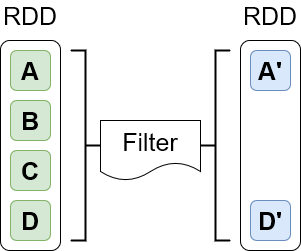
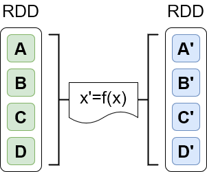
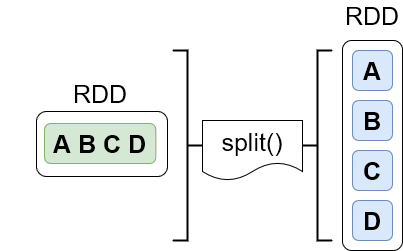
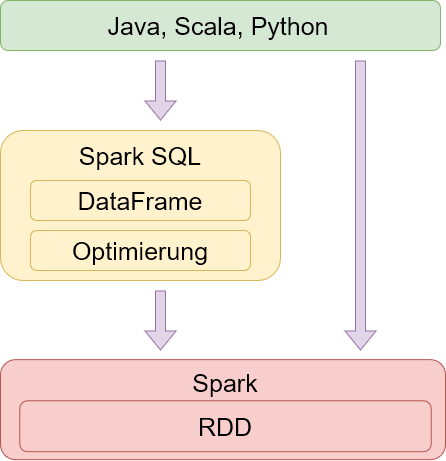
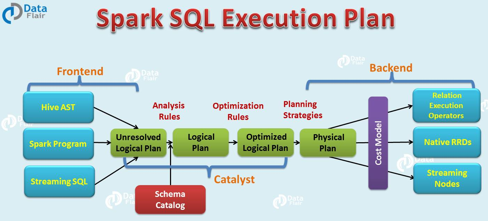

#### [Zum Anfang](README.md "Hier gelangen Sie zur Startseite") | [Inhaltsverzeichnis](00_Inhaltsverzeichnis.md "Hier gelangen Sie zum Inhaltsverzeichnis")

# 2 Datenstrukturen

In den folgenden Unterkapiteln wird ein Überblick über die wichitgsten Konzepte und Datentrukturen gegeben. eingegangen.
Auch soll eine Übersicht über die wichtigsten Funktionalitäten gegeben werden.

Eine vertiefende und vollständige Behandlung aller Themen soll und kann hierbei nicht geleistet werden. Hierzu sei auf
die offizielle Dokumentation sowie weitere Quellen im Internet hingewiesen. Eine erste Orientierung kann hierbei die
[Linksliste](https://github.com/ChristianKitte/SparkProjekt/blob/main/Anhang_Linkliste.md "Hier befindet sich eine Liste mit weiteren Webressourcen zum Thema")
am Ende dieses Repositories geben.

Einen kleinen Einstieg in die Nutzung mit Python bieten zwei praktischen Beispielen in Form von Python Notebooks. Beide
können direkt in Google Colab geöffnet und ausgeführt werden:

* [Praxisbeispiel mit RDDS](06_Wordcount_mit_Spark_RDDs_und_Python.md "Beispiel einer realen Anwendung mit Spark RDDs und Python")
* [Praxisbeispiel mit DataFrames](06_Wordcount_mit_Spark_DataFrames_und_Python.md "Beispiel einer realen Anwendung mit Spark DataFrames und Python")
* [_Hadoop_](02_Datenstrukture#Hadoop )
* [_Spark_](02_Datenstrukture#Spark )

## Hadoop

[_zurück_](02_Datenstrukturen#2-Datenstrukturen "Zurück")

### Distributed Speicher HDFS C

### Map Reduce C

## Spark

[_zurück_](02_Datenstrukturen#2-Datenstrukturen "Zurück")

* [Spark RDDs](Spark_RDDs)
* [Spark Dataframes](Spark_Dataframes)
* [Spark Datasets](Spark_Datasets)
* [Spark DataFrame vs Spark DataSet](Spark_DataFrame_vs_Spark DataSet)
* [Optimierungen](Optimierungen)
* [RDD bis DataSet in a nutshell](RDD_bis_DataSet_in_a_nutshell)
* [Transformationen und Aktionen](Transformationen_und_Aktionen)

### Spark RDDs

#### [_zurück zum Seitenanfang_](02_Datenstrukturen#2-Datenstrukturen "Zurück zum Seitenanfang")

#### [_zurück zum Kapitelanfang_](02_Datenstrukturen#Spark "Zurück zum Kapitelanfang")

RDD steht für Resilient Distributed Dataset (auf deutsch etwa “robuster verteilter Datensatz”) und stellt das zentrale
Konzept und Objekt für die Abstraktion von Datasets innerhalb von Spark da. RDD nutzen lazy evaluation. Code wird somit
erst dann ausgeführt, wenn eine Action angestoßen wird. So können Transformationen effektiv umgesetzt werden. Von
Nachteil ist hierbei, das Daten nicht typisiert sind und ein RDD über keine Schemainformationen verfügt.

RDDs verfügen über die Fähigkeit, beschädigte Spark Knoten oder Partitionen zu ersetzen. Als Legacy Code ermöglicht RDD
eine Low-Level Kontrolle über die Ausführung und Verarbeitung unstrukturierter Daten und ist für alle Arten von
Anwendungen geeignet und über seiner API zugänglich.

Die Arbeit von Spark kann letztlich auf das Anlegen neuer sowie der Transformation und das Ausführen Operationen auf
vorhandenen RDDs betrachtet werden. Hierbei ist das RDD immutable. Jede Aktion auf ein RDD verändert das zugrunde
liegende RDD nicht, sondern gibt stets ein neues RDD zurück. Hierbei nutzt Spark in starken Maße die Übergabe von
Funktionen.

Es gibt verschiedene Wege, um ein RDD zu erstellen. Gemein ist allen, dass Spark bei der Erstellung die Arbeitsdaten
verteilt und später alle Operationen automatisch verteilt und parallelisiert ausführt. Der generelle Workflow ist
hierbei:

* Erstellen des RDD
* Anwenden von Transformationen
* Ausführen von Aktionen

#### Erzeugen von RDDs

Grundsätzlich existieren zwei Möglichkeiten, um ein RDD zu erzeugen. Zum einen ist dies die Verwendung einer
existierenden Collection, zum anderen das Referenzieren eines extern vorliegenden Datasets.

Bei der Verwendung von Collections werden die Daten bereits im Vorfeld aus den jeweiligen Quellen gelesen und in Form
einer geeigneten Collection gehalten. Mithilfe der Methode parallelize wird dann aus der Collection ein RDD erstellt.
Diese Methode eignet sich insbesondere für Datenbestände, welche mit normalen Werkzeugen gut zu handhaben sind:

```python
sc = SparkContext("local", "SampleApp")
integers = list(range(1,6)
integers_rdd = sc.parallelize(integers)
```

Für sehr große Daten ist die Verwendung der textFile Methode sinnvoller. Mit ihrer Hilfe können auch sehr große,
entfernte Daten einem RDD zugeführt werden:

```python
sc = SparkContext("local", "SampleApp")
lines_rdd = sc.textFile("text.txt")
```

Diese Methode eignet sich auch für externe Datenspeicher wie Amazon S3, HDFS, Cassandra, Elasticsearch sowie JDBC.

### Stuff

#### Filter, Map und FlatMap

Zu zu den wichtigsten, aber häufig zu Anfang irritierensten Transformationen zählen die Funktionen Filter, Map und
FlatMap. Daher soll im Folegnden kurz auf die einzelnen Funktionen eingegangen werden. Ihnen allen ist gemain, dass
ihnen eine Funktion in Form einer Lambda Expression als Parameter übergeben wird, welche die eigentliche Transformation
oder Selektierung ausführt.

##### filter

Bei der Filtermethode wird der Funktion eine Filtermethode übergeben, die auf alle Elemente des RDD angewendet wird. Als
Ergebnis wird ein neues RDD auf Basis der selektierten Elemente zurückgegeben.



Der folgende Code würde ein neues RDD zurückgeben, in dem alle (String)Items, welche leer sind, herausgefiltert sind:

```python
sc = SparkContext("local", "SampleApp")
lines = sc.textFile("text.txt")
lines2 = lines.filter(lambda linex: linex.strip() != "")
```

##### map

Bei der Map Methode wird die übergebene Funktion auf alle Elemente des RDD angewendet. Hierbei erfolgt genau eine
Transformation von einem Zustand in einen anderen. Als Ergebnis wird auch hier ein RDD mit den neuen Werten zurück
gegeben.



Der folgende Code würde ein neues RDD mit Integer Werten zurückgeben. Für jedes (String)Item in lines würde in dem neuen
RDD lengths ein (Int)Item für die Länge des entsprechenden Wertes aus lines stehen.

```python
sc = SparkContext("local", "SampleApp")
lines = sc.textFile("text.txt")
lengths = lines.map(lambda line: len(line))
```

Der Typ der zurückgegebenen Elemente muss hierbei nicht dem Typ der ursprünglichen Elemente entsprechen. Wird
beispielsweise für Textelemente die Länge ermittelt, so handelt es sich bei dem zurückgegebenen Elementen um
Zahlenwerte.

##### flatMap

Flat Map unterscheidet sich zu Map dadurch, dass die übergebene Funktion mehr als ein Element zurück geben kann.



Der folgende Code würde für jedes (String)Item des RDD lines den enthaltenen Text auf Basis der Leerstellen splitten und
ein neues RDD mit einer Spalte und n Zeilen zurückgeben.

N würde hierbei der Summe der Längen der jeweils durch splitt erstellten Arrays von Wörtern entsprechen. Als Ergebnis
würde man ein neues (String)RDD wörter erhalten. Jedes seiner Items entspräche dabei ein Wort, seine Länge der Anzahl
der Wörter.

```python
sc = SparkContext("local", "SampleApp")
lines = sc.textFile("text.txt")
wörter = lines.flatMap(lambda line: line.split(" "))
```

###### group, reduce, aggregate und sortByKey

###### collect

###### first

###### count vs countByKey

###### foreach

###### saveAsTextFile

### Spark Dataframes

#### [_zurück zum Seitenanfang_](02_Datenstrukturen#2-Datenstrukturen "Zurück zum Seitenanfang")

#### [_zurück zum Kapitelanfang_](02_Datenstrukturen#Spark "Zurück zum Kapitelanfang")

Die Arbeit auf Basis der zuvor behandelten RDDs ist gut geeignet, wenn man nahe an Spark arbeiten und den größtmöglichen
Einfluss haben möchte. Auf der anderen Seite erfordert die Einarbeitung und der Umgang mit diesem Objekt eine gewisse
Einarbeitung.

Mit der Version 1.3 führte Spark DataFrames ein, welche die sogenannten SchemaRDDs ersetzten. Ab der Version 2.0 dient
die SparkSession als allgemeiner Einstiegspunkt in eine Spark Anwendung. Sie löst den bis dahin genutzen HiveContext
(unstrukturierte Daten) und SQLContext (strukturierte Daten) ab. DataFrames sollen die Arbeit und den Umgang mit Spark
vereinfachen und bieten eine Abstraktion der Datensicht in Spark, nutzen jedoch intern die API der RDDs. Daher können
sie nicht nur auf Basis eines bereits vorhandenen RDDs, sondern auf Basis aller von Spark unterstützten Datenquelle wie
beispielsweise einer Hive Tabelle erzeugt werden. APIs für DataFrames sind für Scala, Java, Python sowie R verfügbar.

Wie zuvor dargestellt, geht man bei der Arbeit mit Spark Dataframes den Weg über eine Spark Session und deren
**_build Methode_**. Anschließend stehen unter anderen eine Reihe von Funktionen wie **_read_** zur Verfügung, um
Textdateien einzulesen.

```python
from pyspark.sql import SparkSession
import pyspark.sql.functions as func

session = SparkSession.builder.appName("Anwendungsname").getOrCreate()
dataframe = session.read.text("Pfad zu einer Datei")
```

Spark Dataframes können hierbei sowohl das Schema der vorhandenen Daten ableiten oder aber ein Schema für die Daten
zugewiesen bekommen. Letzteres ist besonders bei sehr großen Datenbeständen sinnvoll. Zusätzlich kommen bei DataFrames
einQuery-Optimizer für relationale SQL Abfragen sowei ein Catalyst-Optimierer zum Einsatz, der den effizientesten Plan
zur Ausführung der Datenoperationen ermittelt. DataFrames sind daher den RDDs bei der Ausführung überlegen.

Als Nachteil ist jedoch ihre Nähe zu RDDs zu sehen, da sie letztlich eine Kollektion von Row Objekten eines RDD sind.
Erst zur Ausführung greift die Typisierug. Siehe hierzu auch den Artikel von
[Heise](https://www.heise.de/ratgeber/Apache-Spark-2-0-Zweiter-Akt-einer-Erfolgsgeschichte-3292006.html?seite=all "zum Artikel")
.

Dataframes sind somit kein Ersatz der RDDs, sondern können als eine Abstraktionsschicht auf die Daten und deren Handling
mit RDDs angesehen werden. Dies verdeutlicht auch die folgende Abbildung.



Besonders im Umfeld von Python sind Dataframes als Pandas DataFrames bekannt und in der Tat zeigen sich im Umgang eine
Reihe von Gemeinsamkeiten aber auch Unterschiede. Der wichtigste ist, dass ein Spark Dataframe eine verteilte Kollektion
von Daten ist, welche konzeptuell ein zweidimensionalen Array mit Reihen und benannten Spalten eines Datenbestandes
entsprechen. Es wurde für die Verarbeitung sehr großer Datenstände optimiert.

### Spark Datasets

#### [_zurück zum Seitenanfang_](02_Datenstrukturen#2-Datenstrukturen "Zurück zum Seitenanfang")

#### [_zurück zum Kapitelanfang_](02_Datenstrukturen#Spark "Zurück zum Kapitelanfang")

Mit der Version 1.6 wurden Anfang 2016
[Spark DataSet](https://spark.apache.org/docs/latest/api/scala/org/apache/spark/sql/Dataset.html "Zur Dokumentation")
eingeführt. DataSets stellen eine Erweiterung der DataFrames dar und bieten zur Kompiler Zeit Typsicherheit. Ebenso wie
DataFrames sind DataSets Bestandteil von SparkSQL und bieten so die Möglichkeit zur Nutzung von SQL zur Abfrage
strukturierter Daten. Hierbei handelt es sich bei DataSets ebenso wie bei DataFrames um immutable und verteilte
Datensammlungen und profitieren durch stattfindende Optimierungen. Für die Übertragung der DataSet Objekte ist eine
Serialisierung notwendig. Hierfür nutzt Spark einen eigenen leistungsstarken Decoder.

DataSets orten sich eher in Richtung einer stark typisierten objektorientierten Kapselung von Daten ein. Als Konsequent
existiert so nur eine API für Java und Scala. Dies Manko gleicht Python jedoch von Haus aus bereits durch ein
umfangreiches Ökosystem wie Pandas aus.

### Spark DataFrame vs Spark DataSet

#### [_zurück zum Seitenanfang_](02_Datenstrukturen#2-Datenstrukturen "Zurück zum Seitenanfang")

#### [_zurück zum Kapitelanfang_](02_Datenstrukturen#Spark "Zurück zum Kapitelanfang")

Chronologisch existierten Spark DataFrames bereits vor der Einführung der DataSets. Als Erweiterung vereinfachten sie
den Zugriff auf RDDs mit Funktionen wie agg (Aggregat), select (Auswahl), sum (
Summe) und avg (Mittelwert). Für Ihre Erzeugung nutzte man zunächst einen Spark- oder SQLContext. Später eine
SparkSession.

Mit der Einführung der Spark DataSets entstand eine weitere Abstraktion, welche das DataFrame erweiterte, jedoch auch in
Richtung eines objektorientierten Aufbaus änderte. Es wurde die Entscheidung getroffen, beide als Spark DataSet zu
vereinen. In der aktuellen Version existiert somit ein DataSet Objekt, welches sowohl einen stark typisierten Zugriff (
DataSet) und einen nicht typisierten (DataFrame) Zugriff anbietet. Ein DataFrame Objekt wird hierbei als ein
DataSet[row] aufgefasst.

### Optimierungen

#### [_zurück zum Seitenanfang_](02_Datenstrukturen#2-Datenstrukturen "Zurück zum Seitenanfang")

#### [_zurück zum Kapitelanfang_](02_Datenstrukturen#Spark "Zurück zum Kapitelanfang")

#### Catalyst Optimizer

Die Aufgabe des Catalyst Optimizers ist die Optimierung der Ausführung von Berechnungen innerhalb von Spark. Bei
der Konzeption des Optimierers wurde darauf geachtet, dass dieser durch eigene Methoden erweitert und angepasst
werde kann.

Der Optimierer ist ein Bestandteil von Spark SQL. In einem aufwendigen Prozess werden anstehende Transaktionen
zunächst analysiert und anschließend optimiert. Als Ergebnis steht am Ende generierter Java Bytecode, welcher
auf jeder Maschine ausführbar ist. Zur Generierung des Bytecodes wird ein spezielles Features von Scala,
[Quasiquotes](https://docs.scala-lang.org/overviews/quasiquotes/intro.html "zur Dokumentation")
genutzt. Dies ermöglicht die einfache Erstellung von Syntaxbäumen, welche dann mit Hilfe des Scala Compilers zu
Java Bytecode kompiliert wird.

Auf der folgenden Abbildung von
[data-flair](https://data-flair.training/blogs/spark-sql-optimization/ "zur Webseite")
findet sich eine etwas vereinfachte Darstellung des Prozessen:



Der Ausführungsplan unterteilt sich in vier Phasen:

In der ersten Phase werden die anstehenden Transformationen analysiert. Als Ergebnis steht ein logischer
Ausführungsplan am Ende der Verarbeitung. Auf diesen werde in der zweiten Phase die vorhandene Regeln zur Optimierung
ausgeführt. Es entsteht der optimierte logische Ausführungsplan.

Aus dem optimierten logischen Plan werden in der dritten Phase ein oder mehr physikalische Pläne erstellt, welche
anhand des Kostenmodells einer Bewertung unterzogen werden. Am Ende wird der günstigste Plan verwendet und in
der vierten Phase Bytecode generiert, welcher auf jeder Maschine lauffähig ist.

#### Tungsten component

Hinter dem Begriff Tungsteen verbirgt sich ein Sammelprojekt für verschieden Aktivitäten mit dem Ziel, die
Performance von Spark zu verbessern. Grundgedanke ist hierbei, dass weniger Ein- und Ausgabe sowie Netwerke
ein Problem darstellen, sondern in starken Maße Speicher und die Rechenleistung.

### RDD bis DataSet in a nutshell

#### [_zurück zum Seitenanfang_](02_Datenstrukturen#2-Datenstrukturen "Zurück zum Seitenanfang")

#### [_zurück zum Kapitelanfang_](02_Datenstrukturen#Spark "Zurück zum Kapitelanfang")


|                                 | RDD                          | Spark DataFrames        | Spark DataSets                  |
| --------------------------------- | ------------------------------ | ------------------------- | --------------------------------- |
| Funktionalität                 | Verteilte Sammlung von Daten | Organisation in Spalten | Erweiterung des DataFrame (OOP) |
| Seit Version                    | 1.0                          | 1.3                     | 1.6                             |
| Typesicherheit zur Kompilerzeit | Nein                         | Nein                    | Ja                              |
| APIs verfügbar                 | Nein                         | Ja                      | Ja                              |
| Spark SQL                       | Nein                         | Ja                      | Ja                              |
| Catalyst Optimizer              | Nein                         | Ja                      | Ja                              |
| Tungsten component              | Nein                         | Ja                      | Ja                              |
| Sprachen                        | Java, Scala, Python, R       | Java, Scala, Python, R  | Java, Scala                     |

### Transformationen und Aktionen

#### [_zurück zum Seitenanfang_](02_Datenstrukturen#2-Datenstrukturen "Zurück zum Seitenanfang")

#### [_zurück zum Kapitelanfang_](02_Datenstrukturen#Spark "Zurück zum Kapitelanfang")

Spark kennt zwei grundsätzliche Operationen. Die Transformation führt eine Aktion auf Daten aus und liefert ein neues
Objekt zurück. Eine Aktion hingegen führt eine Berechnung aus und liefert das Ergebnis der Berechnung zurück.

Hierbei werden die Transformationen nicht unverzüglich, sondern erst zu einen späteren Zeitpunkt ausgeführt. Diese
Zeitpunkt ist in der Regel die Ausführung einer Aktion, welche ein Ergebnis zurück liefert. Spark führt somit ein lazy
computing aus.

Dieses Vorgehen ermöglicht Spark, zu einem möglichst späten Zeitpunkt mit der Bearbeitung zu beginnen und eröffnet so
die Möglichkeit, Transformationsschritte zu optimieren. Grundsätzlich werden hierbei in der Grundeinstellung die
Berechnungen bei jedem Aufruf der Action wiederholt, jedoch existiert auch die Option einer Persistierung der
Ergebnisse.

#### Übergabe von Funktionen

Spark macht in sehr starken Umfang Gebrauch von der
[Übergabe von Funktionen](https://spark.apache.org/docs/latest/rdd-programming-guide.html#passing-functions-to-spark "zur Dokumentation")
. Dieses Konzept eröffnet zum einen einen sehr umfangreiche Möglichkeiten zur Bearbeitung der Daten, ist jedoch
andererseits nicht jeden sehr vertraut und Sprachabhängig.

Im Context von Python gibt es drei Möglichkeiten, eine Funktion zu definieren und zu übergeben:

1. Nutzen einer
   [Lambda Expression](https://docs.python.org/2/tutorial/controlflow.html#lambda-expressions "zur Dokumentation")

```python
# Die Methode flatMap iteriert durch jedes Element line und gibt das durch
# split(" ") erzeugte array zurück.

words=lines.flatMap(lambda line: line.split(" "))
```

2. Definition und Übergabe einer lokalen Funktion

```python
# Die Methode main_function ist die Hauptmethode. 
#
# Der darin enthaltene lokalen Methode do_split wird ein String übergeben. Die 
# Methode ruft die Split Methode des String auf und gibt das Ergebnis zurück.
#
# Der Methode flatMap wird die Funktion do_split übergeben. Sie iteriert durch 
# jedes Element, übergibt es an do_split und gibt das Ergebnis zurück.

def main_function():
    def do_split(line):
        return line.splitt(" ")

    words=lines.flatMap(do_split)
```

3. Definition und Übergabe einer Top-Level Funktion in einem Modul.

```python
# Der globalen Methode do_split innerhalb eines Moduls wird ein String übergeben. Die 
# Methode ruft die Split Methode des String auf und gibt das Ergebnis zurück.
#
# Der Methode flatMap wird die globale Funktion do_split übergeben. Sie iteriert durch 
# jedes Element, übergibt es an do_split und gibt das Ergebnis zurück.
  
if __name__ == "__main__":
    def main_function():
        def do_split(line):
            return line.splitt(" ")

    words=lines.flatMap(do_split)
```
