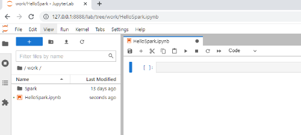

#### [Zum Anfang](README.md "Hier gelangen Sie zur Startseite") | [Inhaltsverzeichnis](00_Inhaltsverzeichnis.md "Hier gelangen Sie zum Inhaltsverzeichnis")

# 3 Mögliche Umgebungen für Spark

In den folgenden drei Unterkapiteln werden Wege aufgezeigt, wie eine produktiv einsetzbare Umgebung für Spark auf 
einfachen Wege eingerichtet werden kann. 

Hierbei wird zunächst die Möglichkeiten aufgezeigt, Spark im Umfeld eines Clouddienstleisters zu betreiben. Dies 
ist vor allem für Unternehmen oftmals eine sinnvolle Lösung, kann aber auch für den ersten Kontakt ansich 
eine kostengünstige und einfach umzusetzende Lösung sein. Anschließend werden Lösungen auf Basis von Google und 
Docker vorgestellt. Beide verbindet, dass sie kostenlos und einfach verfügbar sind.

Spark kann zudem auch auf einen lokalen Rechner eingerichtet werden. Dieser Weg hat jedoch den Nachteil, dass er 
eine Reihe von Downloads, Installationen und Einstellungen bedarf. Für einen ersten Kontakt ist dies nicht optimal
und wird daher hier nicht berücksichtigt. 

* [_Spark in der Cloud_](03_Mögliche_Umgebungen_für_Spark.md#spark-in-der-cloud )
* [_Spark mit Google Colaboratory (Colab)_](03_Mögliche_Umgebungen_für_Spark.md#spark-mit-google-colaboratory-colab )
* [_Spark mit Docker_](03_Mögliche_Umgebungen_für_Spark.md#spark-mit-docker )

## Spark in der Cloud

[_zurück_](03_Mögliche_Umgebungen_für_Spark.md#3-mögliche-umgebungen-für-spark "Zurück")

Insbesondere für Unternehmen kann sich der Einsatz von Spark im Umfeld einer Cloud sinnvoll sein. In der Regel 
können Lösungen zunächst kostengünstig implementiert und mit zunehmenden Nutzen hoch skaliert werden. Die einfache 
Verfügbarkeit macht diese Optionen aber auch für einen ersten Kontakt interessant, da oftmals kostenlose Testzeiträume 
angeboten werden. Grundsätzlich handelt es sich jedoch in der Regel nicht um eine kostenlose Lösung. 

In diesen Abschnitt sollen nicht repräsentativ kurz auf die Angebote von Microsoft Azure, Amazon AWS sowie Google Cloud 
als größte Anbieter von Cloudlösungen eingegangen werden.

### Microsoft Azure

Hinter 
[Microsoft Azure](https://azure.microsoft.com/de-de/ "zur Einstiegsseite") 
verbirgt sich die Cloudsparte von Microsoft mit seine cloudbasierten Services und Anwendungen.
Innerhalb von Azure wird Spark in den Bereich Machine Learning unter den Begriff 
[Azure Databricks ein.](https://azure.microsoft.com/de-de/services/databricks/ "zur Einstiegsseite")
einsortiert.

Azur ermöglicht eine einfache, angeleitete und sehr schnelle Einrichtung von autoskalierten Spark Clustern und 
somit ein schnelles Ergebnis. Zusätzlich findet sich sehr umfangreiche 
[Dokumentation](https://docs.microsoft.com/de-de/azure/databricks/ "zur Dokumentation") 
zur Arbeit mit Azure Databricks alias Spark.

Daneben bietet Azur die Integration eines Zeppelin Notebooks und ermöglicht somit ein ähnlich komfortables Arbeiten 
wie im Umfeld von Google Colab weiter unten auf dieser Seite. 

Neben der Integration von Git Hub, können im Umfeld von Azure Databricks weitere Dienste von Azure einfach  
genutzt und integriert werden. Hierzu gehören:
- Azure Synapse Analytics (Auslastung)
- Azure Machine Learning (KI Algorithmen und Unterstützung für eine Vielzahl von KI Frameworks)
- Azure Data Factory (Datenintegration)
- Azure Data Lake Storage (Datenhaltung)

Wie alle Cloudanbieter richten sich die 
[Kosten](https://azure.microsoft.com/de-de/pricing/details/databricks/ "zur Preisübersicht") 
in erster Linie nach den benötigten Platz, der Leistungsfähigkeit 
sowie der Rechenzeit. Somit ist es notwendig, eine sehr genaue Erwartung zu haben, um einen angenäherten Preis zu 
bestimmen. 

Azure eignet sich auf Grund seines aufgeräumten Designs, der umfangreichen Verfügbarkeit soie des 30 tägigen 
kostenlosen Testzeitraums aber auch für ein erstes Kennenlernen von Spark im Enterprisebereich. 

### Amazon AWS

### Google Cloud

## Spark mit Google Colaboratory (Colab)

[_zurück_](03_Mögliche_Umgebungen_für_Spark.md#3-mögliche-umgebungen-für-spark "Zurück")

Ein einfache Möglichkeit, um mit Spark zu arbeiten, bietet
[Google Colaboraty](https://colab.research.google.com/?utm_source=scs-index "Hier geht es zu Colaboraty")
oder einfach Google Colab. Bei Google Colab handelt es sich um eine von Google kostenlos zur Verfügung gestellte
Umgebung für ein Jupyter Notebook.

Das Notebook eignet sich zum collaborativen Arbeiten und kann wie andere Dokumente innerhalb von Drive einfach
freigegeben werden. Aus den Notebook ist grundsätzlich ein Zugriff auf das eigene Drive möglich, jedoch nicht zwingend
notwendig.

Der Vorteil bei dieses Vorgehens ist die vorhandene Infrastruktur für das Notebook und die Möglichkeit einer doch
beachtenserten Rechenleistung der darunter liegenden virtuellen Maschine. Als Betriebssystem dient Linux. Sowhl Python
als auch Jupyter ist mit den gängigsten Bibliotheken vorinstalliert.

Als größter Nachteil ist die Flüchtigkeit der Daten zu nennen. jedes Ergebnis, aber auch jede gemachte Installation und
Download von Daten wird nach einer Zeit der Inaktivität gelöscht. Daher empfielt es sich, in seinen Routinen immer auch
die Vorbereitung des Notebooks zu hinterlegen.

Alle im folgenden beschriebenen Arbeitsschritte finden sich auh als lauffähiges Beispiel im
[_Jupyter Notebook_](notebook/Wordcount_mit_Spark.ipynb "Zum Notebook")
im Abschnitt **Vorbereitung des Notebooks**.

### Vorbereiten des Notebooks

Für den Einsatz von Spark sind in jedem Fall drei Voraussetzungen notwendig:

+ [Java](https://openjdk.java.net/ "Zur Homepage von OpenJDK") muss instaliert sein, damit Spark ausgeführt werden kann.
+ [Spark](https://spark.apache.org/ "Zur Homepage von Spark") muss installiert sein
+ die Bibliothek [FindSpark](https://pypi.org/project/findspark/ "Zur Dokumentation") muss installiert sein
+ die Bibliothek [PySpark](https://spark.apache.org/docs/latest/api/python/ "Zur Dokumentation")
  muss installiert sein. Auf den Seiten von Apache.org findet man
  [weiter gehende Informationen zu PySpark](https://spark.apache.org/docs/latest/api/python/ "Zur Apache Dokumentation")

#### Installation von Java und Spark

[Spark](https://spark.apache.org/ "Zur Homepage von Spark") wurde in der Programmiersprache
[Java](https://openjdk.java.net/ "Zur Homepage von OpenJDK") geschrieben. Für seine Ausführung ist es daher notwendig,
eine Java Umgebung einzurichten. Hierfür muss eine Installationsdatei für Java heruntergeladen und installiert werden.
Spark selbst hingegen benötigt als Java Programm keine Installation, sondern lediglich eine korrekt installierte Java
Laufzeit.

```Python 
# Installation  von Java
!apt-get install openjdk-8-jdk-headless -qq > /dev/null

print("Java ist installiert...")

# Download und Entpacken von Spark (Versionsnummer anpassen!)
!wget -q https://archive.apache.org/dist/spark/spark-3.2.0/spark-3.2.0-bin-hadoop3.2.tgz
!tar xf spark-3.2.0-bin-hadoop3.2.tgz

print("Spark ist verfügbar...")
```

Nach der Installation und für den Betrieb ist es sehr wichtig, alle Systemvariablen für Spark und Java korrekt zu
setzen. Der folgende Code zeigt beide genannten Schritte.

```Python 
# Setzen der Systemvariablen für Java und Spark
import os
os.environ["JAVA_HOME"] = "/usr/lib/jvm/java-8-openjdk-amd64"
os.environ["SPARK_HOME"] = "/content/spark-3.2.0-bin-hadoop3.2"

print("Umgebungsvariablen sind gesetzt...")
```

#### Installation der benötigten Python Bibliotheken

Nach Ausführung beider Schritte existiert eine Umgebung mit einer funktionierende Spark Installation. Um einfach mit
Spark und Python arbeiten zu können, fehlen noch zwei Bibliotheken.

[PySpark](https://spark.apache.org/docs/latest/api/python/ "Zur Apache Dokumentation") ist ein Interface für die Nutzung
von Spark mit Python. Es ermöglicht also die Programmierung von Sparkanwendungen mit Python. Hierbei werden die meißten
der Features von Spark unterstützt.

```Python 
# Installation von findspark und pyspark

!pip install findspark
print("FindSpark wurde installiert...")

!pip install pyspark
print("PySpark wurde installiert...")
```

Damit
[PySpark](https://spark.apache.org/docs/latest/api/python/ "Zur Dokumentation")
von Python genutzt und importiert werden kann, müssen beide voneinander wissen. Hier
kommt [FindSpark](https://pypi.org/project/findspark/ "Zur Dokumentation") ins Spiel.

#### Initialisierung der Programmierumgebung

Laut Aussage des [Git Repository](https://github.com/minrk/findspark "Zum Repository")
von FindSpark bieten sich Grundsätzlich zwei Wege an. Mit dem ersten wird die PySpark so verlinkt, dass Python es finden
kann. Dies ist im allgemeinen bei den verwendeten Packages. Bei Verwendung des zweiten Weges wird der Pfad zu
[PySpark](https://spark.apache.org/docs/latest/api/python/ "Zur Dokumentation")
mit im Systempfad hinterlegt.

[FindSpark](https://pypi.org/project/findspark/ "Zur Dokumentation")
verwendet die zweite Option und fügt den Pfad zu PySpark zur Laufzeit dem Systempfad hinzu. Hierzu wird der Befehl
init() genutzt.

```Python 
# Initialisieren von findspark

try: 
  import findspark
  from pyspark import SparkContext, SparkConf
  
  findspark.init()
  
  print("FindSpark und PySpark wurden initialisiert")
except ImportError: 
  raise ImportError("Fehler bei der Initialiserung von FindSpark und PySpark")
```

### Vor- und Nachteile

Als Vorteile dieser Vorgehensweise sind zu nennen:

* kostenlos
* überall verfügbar
* Möglichkeit zur colaborativen Zusammenarbeit
* einfache Nutzung, da sowohl das Notebook als auch die Python Umgebung vorhanden
* eignet sich für Lehrzwecke, kleine Projekte, Prototyping und Verteilung von Beispielen
* Leistungsfähiges virtuelles System

Als Nachteile sind zu nennen:

* keine dauernde Serialisierung der Ergebnisse, Installationen oder Daten
* Vor der Arbeit ist das System erst wieder zu erstellen
* Google Ökosystem steht im Ruf nicht sehr annonym zu sein

## Spark mit Docker

[_zurück_](03_Mögliche_Umgebungen_für_Spark.md#3-mögliche-umgebungen-für-spark "Zurück")

Die Verwendung von Google Colaboratory zeigte bereits eine einfache Möglichkeit, ein Spark Umgebung für die Verwendung
mit Python zu erstellen. Verfügbar war diese Lösung jedoch nur innerhalb des Google Ökosystems.

Spark mit Docker bietet eine weitere einfache Möglichkeit, um Docker auf einen lokalen Rechner verfügbar zu machen. In
diesen Abschnitt wird gezeigt, wie mit Hilfe von Docker eine in _Jupyter Notebook_ verfügbare Sparkumgebung angelegt
werden kann.

Bei Docker arbeitet man mit sogenannten Containern, welche einen Prozess visualisieren. Die Basis eines Containers
bildet ein Image. Ein gute Einführung zu Docker findet sich auf den Seiten von
[Docker](https://docs.docker.com/get-started/overview/ "Hier gelangen Sie zur Homepage von Docker").

Einer der Vorteile von Docker ist die sehr große Sammlung bereits fertiger Images
im [Docker Hub](https://hub.docker.com/ "Hier gelangen Sie zum Portal von Docker Hub"). Hier finden sich für viele
Anwendungsfälle bereits vorgefertigte Lösungen.

Unabhängig von Spark ist für die Ausführung eines Docker Containers die Installation einer Docker Runtime notwendig.
Diese ist in Form eines _Docker Desktop_ für die Plattformen Mac, Windows und Linux verfügbar. Die Installation von
Docker ist nicht Teil dieser Arbeit, jedoch findet sich eine gute Einführung
auf [Docker](https://docs.docker.com/get-started/overview/ "Hier gelangen Sie zur Homepage von Docker").

### Dockerimage

Als Basis dient das [_Jupyter Notebook Python, Spark
Stack_](https://hub.docker.com/r/jupyter/pyspark-notebook "Hier gelangen Sie zum Image im Docker Hub")
Notebook. Es beinhaltet ein fertig konfiguriertes Linux System mit installierten Java, Python und Spark. Es ist also
nicht nötig, manuelle Einstallungen oder Installationen auszuführen, um Spark innerhalb eines [_Jupyter
Notebooks_](https://jupyter.org/index.html "Hier gelangen Sie zur Homepage von Jupyter") auszuführen.

### Download und erster Start

Dieser Schritt setzt die Installation des _Docker Desktop_ wie oben beschrieben voraus. In einer Eingabekonsole wird der
folgende Befehl eingegeben:

``` 
docker run -p 8888:8888 -e JUPYTER_ENABLE_LAB=yes --name pyspark jupyter/pyspark-notebook
```

Bei der ersten Ausführung wird das Image _jupyter/pyspark-notebook_ direkt vom _Docker Hub_ herunter geladen, sofern es
noch nicht lokal vorhanden ist. Anschließend wird auf Basis des heruntergeladenen Image ein Container erstellt. Dieser
Container horcht auf dem _Port 8888_ und [_
JupyterLab_](https://jupyterlab.readthedocs.io/en/stable/ "Hier gelangen Sie zur Dokumentation von JupyterLab") ist
aktiv. Der Name des erstellten Containers lautet _pyspark_.

Nach dem ersten Zugriff auf den Container, kann dieser wie im folgenden gezeigt, einfach gestartet werden:

```
docker start -a pyspark
```

Möchte man bei der Arbeit mit Jupyter Notebook auf eigene Daten oder Verzeichnisse zugreifen, so müssen sie vor dem
Start für den Container zugänglich gemacht werden. Hierfür gibt es eine Reihe von Möglichkeiten.

Um innerhalb eines Containers mit eigenen Daten zu arbeiten, müssen diese aus dem Container zugreifbar sein. Hierfür
gibt
es [verschiedene Möglichkeiten](https://docs.docker.com/storage/ "Hier gelangen Sie zu einer Seite in docker docs, welche verschiedene Möglichkeiten zum Einbinden von Laufwerken zeigt")
. Ein einfacher Weg ist das Kopieren der Dateien oder Verzeichnisse in den Container. Hierzu darf dieser nicht gestartet
sein:

```
cp [DOWNLOAD VERZEICHNIS] pyspark:/home/jovyan/work
```

### Zugriff auf das Jupyter Notebook

Während des Startvorgangs erfolgen ene Reihe an Ausgaben auf der Konsole. Am Ende wird eine URL mit einem Token
ausgegeben.


Über einem Browser gelangt man hiermit zur Eingabekonsole des _Jupyter Notebooks_. Da bereits alle für Spark benötigten
Installationen und Einstellungen gemacht wurden, kann dort direkt wie oben unter [_Google
Colaboratory_](03_Mögliche_Umgebungen_für_Spark.md#spark-mit-google-colaboratory-colab "Hier geht es zum Abschnitt Spark mit Google Colaboratory (Colab)")
beschrieben gearbeitet werden.



### Vor- und Nachteile

Als Vorteile dieser Vorgehensweise sind zu nennen:

* kostenlos
* einfache Verfügbarkeit über _Docker Hub_
* einfache Nutzung, da alle Installationen und Einstellungen vorhanden sind
* eignet sich für Lehrnzwecke und lokales Arbeiten mit übersichtlichen Datenmengen
* Daten und Ergebnisse können mit dem Container serialisiert werden kann auch produktiv zum Aufbau der eigenen
  Infrastruktur eingesetzt werden
* kann auch im Serverumfeld - dann mit größeren Datenbeständen und/oder verteilt - eingesetzt werden

Als Nachteile sind zu nennen:

* sofern Anpassungen notwendig sind, werden auch hier tiefere Kenntnisse benötigt
* als Out-of-the-Box Lösung, ist man auf das Wissen und die Fähigkeiten der Anbieter angewiesen
* Notwendigkeit zur Installation einer _Docker Laufzeit_ mit privilegierten Rechten
* Sicherheitsrisiken im Umfeld von _Docker_ können das eigene System gefährden
