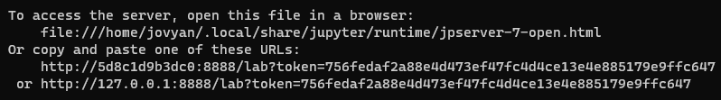

#### [Zum Anfang](README.md "Hier gelangen Sie zur Startseite") | [Inhaltsverzeichnis](00_Inhaltsverzeichnis.md "Hier gelangen Sie zum Inhaltsverzeichnis")

# 3 Mögliche Umgebungen für Spark

In den folgenden vier Unterkapiteln werden Wege aufgezeigt, wie eine produktiv einsetzbare Sparkumgebung eingerichtet
werden kann.

* [_Spark in der Cloud_](03_Mögliche_Umgebungen_für_Spark.md#spark-in-der-cloud )
* [_Spark lokal_](03_Mögliche_Umgebungen_für_Spark.md#spark-local )
* [_Spark mit Google Colaboratory (Colab)_](03_Mögliche_Umgebungen_für_Spark.md#spark-mit-google-colaboratory-colab )
* [_Spark mit Docker_](03_Mögliche_Umgebungen_für_Spark.md#spark-mit-docker )

## Spark in der Cloud

[_zurück_](03_Mögliche_Umgebungen_für_Spark.md#3-mögliche-umgebungen-für-spark "Zurück")

## Spark lokal

[_zurück_](03_Mögliche_Umgebungen_für_Spark.md#3-mögliche-umgebungen-für-spark "Zurück")

## Spark mit Google Colaboratory (Colab)

[_zurück_](03_Mögliche_Umgebungen_für_Spark.md#3-mögliche-umgebungen-für-spark "Zurück")

## Spark mit Docker

[_zurück_](03_Mögliche_Umgebungen_für_Spark.md#3-mögliche-umgebungen-für-spark "Zurück")

Spark mit Docker bietet eine weitere einfache Möglichkeit, um Docker auf einen lokalen Rechner verfügbar zu machen. In
diesen Abschnitt wird gezeigt, wie mit Hilfe von Docker eine in _Jupyter Notebook_ verfügbare Sparkumgebung angelegt
werden kann.

Bei Docker arbeitet man mit sogenannten Containern, welche einen Prozess visualisieren. Die Basis eines Containers
bildet ein Image. Ein gute Einführung zu Docker findet sich auf den Seiten von
[Docker](https://docs.docker.com/get-started/overview/ "Hier gelangen Sie zur Homepage von Docker").

Einer der Vorteile von Docker ist die sehr große Sammlung bereits fertiger Images
im [Docker Hub](https://hub.docker.com/ "Hier gelangen Sie zum Portal von Docker Hub"). Hier finden sich für viele
Anwendungsfälle bereits vorgefertigte Lösungen.

Unabhängig von Spark ist für die Ausführung eines Docker Containers die Installation einer Docker Runtime notwendig.
Diese ist in Form eines _Docker Desktop_ für die Plattformen Mac, Windows und Linux verfügbar. Die Installation von
Docker ist nicht Teil dieser Arbeit, jedoch findet sich eine gute Einführung
auf [Docker](https://docs.docker.com/get-started/overview/ "Hier gelangen Sie zur Homepage von Docker").

### Dockerimage

Als Basis dient das [_Jupyter Notebook Python, Spark
Stack_](https://hub.docker.com/r/jupyter/pyspark-notebook "Hier gelangen Sie zum Image im Docker Hub")
Notebook. Es beinhaltet ein fertig konfiguriertes Linux System mit installierten Java, Python und Spark. Es ist also
nicht nötig, manuelle Einstallungen oder Installationen auszuführen, um Spark innerhalb eines [_Jupyter
Notebooks_](https://jupyter.org/index.html "Hier gelangen Sie zur Homepage von Jupyter") auszuführen.

### Download und erster Start

Dieser Schritt setzt die Installation des _Docker Desktop_ wie oben beschrieben voraus. In einer Eingabekonsole wird der
folgende Befehl eingegeben:

  docker run -p 8888:8888 -e JUPYTER_ENABLE_LAB=yes --name pyspark jupyter/pyspark-notebook

Bei der ersten Ausführung wird das Image _jupyter/pyspark-notebook_ direkt vom _Docker Hub_ herunter geladen, sofern es
noch nicht lokal vorhanden ist. Anschließend wird auf Basis des heruntergeladenen Image ein Container erstellt. Dieser
Container horcht auf dem _Port 8888_ und [_
JupyterLab_](https://jupyterlab.readthedocs.io/en/stable/ "Hier gelangen Sie zur Dokumentation von JupyterLab") ist
aktiv. Der Name des erstellten Containers lautet _pyspark_.

Nach dem ersten Zugriff auf den Container, kann dieser wie im folgenden gezeigt, einfach gestartet werden:

docker start -a pyspark
Möchte man bei der Arbeit mit Jupyter Notebook auf eigene Daten oder Verzeichnisse zugreifen, so müssen sie vor dem
Start für den Container zugänglich gemacht werden. Hierfür gibt es eine Reihe von Möglichkeiten.

Um innerhalb eines Containers mit eigenen Daten zu arbeiten, müssen diese aus dem Container zugreifbar sein. Hierfür
gibt
es [verschiedene Möglichkeiten](https://docs.docker.com/storage/ "Hier gelangen Sie zu einer Seite in docker docs, welche verschiedene Möglichkeiten zum Einbinden von Laufwerken zeigt")
. Ein einfacher Weg ist das Kopieren der Dateien oder Verzeichnisse in den Container. Hierzu darf dieser nicht gestartet
sein:

  cp [DOWNLOAD VERZEICHNIS] pyspark:/home/jovyan/work

### Zugriff auf das Jupyter Notebook

Während des Startvorgangs erfolgen ene Reihe an Ausgaben auf der Konsole. Am Ende wird eine URL mit einem Token
ausgegeben.

Über einem Browser gelangt man hiermit zur Eingabekonsole des _Jupyter Notebooks_. Da bereits alle für Spark
benötigten Installationen und Einstellungen gemacht wurden, kann dort direkt wie oben unter [_Google
Colaboratory_](03_Mögliche_Umgebungen_für_Spark.md#spark-mit-google-colaboratory-colab "Hier geht es zum Abschnitt Spark mit Google Colaboratory (Colab)")
beschrieben gearbeitet werden.

### Vor- und Nachteile

Als Vorteile dieser Vorgehensweise sind zu nennen:

* einfache Verfügbarkeit über _Docker Hub_
* einfache Nutzung, da alle Installationen und Einstellungen vorhanden sind
* eignet sich für Lehrnzwecke und lokales Arbeiten mit übersichtlichen Datenmengen
* Daten und Ergebnisse können mit dem Container serialisiert werden kann auch produktiv zum Aufbau der eigenen
  Infrastruktur eingesetzt werden
* kann auch im Serverumfeld - dann mit größeren Datenbeständen und/oder verteilt - eingesetzt werden

Als Nachteile sind zu nennen:

* sofern Anpassungen notwendig sind, werden auch hier tiefere Kenntnisse benötigt
* als Out-of-the-Box Lösung, ist man auf das Wissen und die Fähigkeiten der Anbieter angewiesen
* Notwendigkeit zur Installation einer _Docker Laufzeit_ mit privilegierten Rechten
* Sicherheitsrisiken im Umfeld von _Docker_ können das eigene System gefährden
